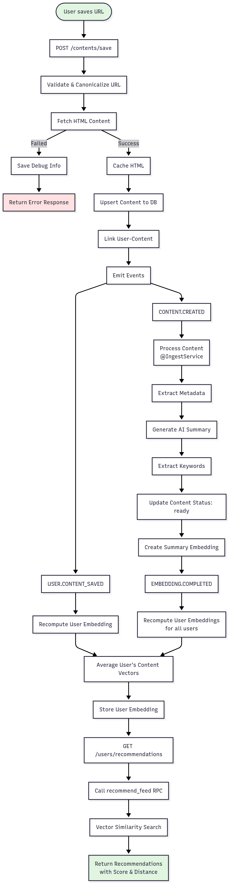

# PICO : Personal Intelligent COpilot

Personal AI playground

## Content Recommendation Flow

## Vertical Applications

### picoQUEUE `/apps/mobile-queue` : Content recommendation mobile app

### Recommend flow

### Technology

- [expo react native](https://docs.expo.dev/)
- AUTH: [Clerk](https://clerk.com/docs)
- [Supabase](https://supabase.com/docs): database
- Tanstack query
- [react native reusables](https://reactnativereusables.com/docs)

## AI Playground

### AI Backend

#### `/app/mastra` : [mastra.ai](https://mastra.ai/)

deployed on [mastra cloud](https://mastra.ai/en/docs/mastra-cloud/overview)

#### [LangChain.js](https://js.langchain.com/docs/introduction/) + [LangGraph.js](https://langchain-ai.github.io/langgraphjs/tutorials/quickstart/)

With [nest.js](https://docs.nestjs.com/) API Server

- deployed on [Railway](https://docs.railway.com/)

### WEB

- `/apps/web` : [next.js](https://nextjs.org/docs)
  - deployed on [vercel](https://vercel.com/docs)
