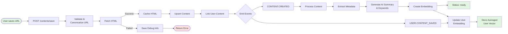

```mermaid
flowchart LR
    Start([User saves URL]) --> API[POST /contents/save]
    API --> Validate[Validate &<br/>Canonicalize URL]
    Validate --> Fetch[Fetch HTML]

    Fetch -->|Success| Cache[Cache HTML]
    Fetch -->|Failed| Debug[Save Debug Info]
    Debug --> Error([Return Error])

    Cache --> DB[Upsert Content]
    DB --> Link[Link User-Content]
    Link --> Events{Emit Events}

    Events --> E1[CONTENT.CREATED]
    Events --> E2[USER.CONTENT_SAVED]

    E1 --> Process[Process Content]
    Process --> Meta[Extract Metadata]
    Meta --> AI[Generate AI Summary<br/>& Keywords]
    AI --> Emb[Create Embedding]
    Emb --> Ready[Status: ready]

    E2 --> UserEmb[Update User<br/>Embedding]
    Emb --> UserEmb
    UserEmb --> Store[Store Averaged<br/>User Vector]

    style Start fill:#e1f5e1
    style Ready fill:#e1f5e1
    style Store fill:#e1f5e1
    style Error fill:#ffe1e1
```
