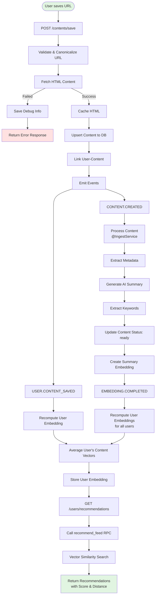

```mermaid
flowchart TD
    Start([User saves URL]) --> API[POST /contents/save]

    API --> Validate[Validate & Canonicalize URL]
    Validate --> Fetch[Fetch HTML Content]

    Fetch -->|Success| Cache[Cache HTML]
    Fetch -->|Failed| Debug[Save Debug Info]
    Debug --> Error[Return Error Response]

    Cache --> DB1[Upsert Content to DB]
    DB1 --> Link[Link User-Content]
    Link --> Events[Emit Events]

    Events --> Event1[CONTENT.CREATED]
    Events --> Event2[USER.CONTENT_SAVED]

    Event1 --> Process[Process Content<br/>@IngestService]
    Process --> Extract[Extract Metadata]
    Extract --> Summary[Generate AI Summary]
    Summary --> Keywords[Extract Keywords]
    Keywords --> Update[Update Content Status: ready]
    Update --> Embedding[Create Summary Embedding]

    Embedding --> Event3[EMBEDDING.COMPLETED]

    Event2 --> UserEmb1[Recompute User Embedding]
    Event3 --> UserEmb2[Recompute User Embeddings<br/>for all users]

    UserEmb1 --> AvgVec[Average User's Content Vectors]
    UserEmb2 --> AvgVec
    AvgVec --> StoreUserEmb[Store User Embedding]

    StoreUserEmb --> Recommend[GET /users/recommendations]
    Recommend --> RPC[Call recommend_feed RPC]
    RPC --> VectorSearch[Vector Similarity Search]
    VectorSearch --> Results[Return Recommendations<br/>with Score & Distance]

    style Start fill:#e1f5e1
    style Results fill:#e1f5e1
    style Error fill:#ffe1e1
```
