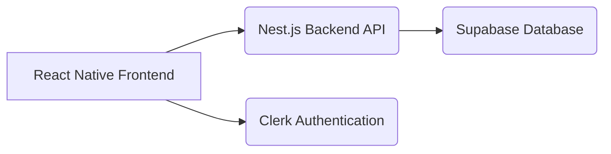

# Technical Requirements Document (TRD)

## 1. Executive Technical Summary

- **Project Overview**: This project involves developing a mobile application, "ReadLater," designed to help users cultivate consistent reading habits and achieve learning goals. The application will enable users to save, organize, and prioritize articles and other web content into a manageable reading list.
- **Core Technology Stack**: The application will be built using React Native for the mobile frontend, Nest.js for the backend API, Supabase for database and authentication, and Clerk for enhanced authentication and user management features.
- **Key Technical Objectives**: The primary objectives are to create a performant, scalable, and reliable application with an intuitive user interface. Performance targets include fast content loading, seamless navigation, and efficient data synchronization. Scalability will be achieved through a microservices-friendly backend architecture and efficient database design. Reliability will be ensured through comprehensive testing and monitoring.
- **Critical Technical Assumptions**: We assume that users have a stable internet connection for content saving and synchronization. We also assume that the chosen third-party services (Supabase, Clerk) will maintain their APIs and service availability as documented.

## 2. Tech Stack

| Category            | Technology / Library        | Reasoning (Why it's chosen for this project)                                                                                                                                                                                                                                                                                                                                            |
| ------------------- | --------------------------- | --------------------------------------------------------------------------------------------------------------------------------------------------------------------------------------------------------------------------------------------------------------------------------------------------------------------------------------------------------------------------------------- |
| **Frontend**        | React Native                | Cross-platform mobile development allows for code reuse across iOS and Android, reducing development time and cost.                                                                                                                                                                                                                                                                  |
| **Backend**         | Nest.js                     | Provides a robust and scalable backend framework with TypeScript support, enabling efficient API development and maintainability. It facilitates modular design and separation of concerns, crucial for long-term project evolution.                                                                                                                                                  |
| **Database**        | Supabase                    | Offers a scalable and cost-effective PostgreSQL database with real-time capabilities. It simplifies database management and provides built-in authentication and authorization features, reducing development overhead.                                                                                                                                                              |
| **Authentication**  | Clerk                       | Provides pre-built user authentication and management components, simplifying the implementation of secure user accounts, session management, and access control. Clerk reduces the need to build custom authentication logic and integrates seamlessly with React Native and Nest.js.                                                                                             |
| **State Management** | React Context API / Redux (Consider Redux only if the app becomes complex.)  | React Context API provides a simple and efficient way to manage application state. For more complex state management needs, Redux can be integrated to provide a predictable state container.                                                                                                                                                           |
| **API Client** | Axios/Fetch  |  To perform HTTP requests to the backend API.  |

## 3. System Architecture Design

### Top-Level building blocks

*   **Mobile Frontend (React Native)**:
    *   *UI Components*: Reusable components for displaying content, lists, and forms.
    *   *Navigation*: Handles screen transitions and user flow.
    *   *State Management*: Manages application state (e.g., user data, reading list).
    *   *API Client*: Communicates with the backend API.
*   **Backend API (Nest.js)**:
    *   *Controllers*: Handle incoming HTTP requests and route them to appropriate services.
    *   *Services*: Implement business logic for managing users, content, and reading lists.
    *   *Modules*: Organize related controllers and services into functional units.
    *   *Data Access Layer*: Interacts with the Supabase database.
*   **Database (Supabase)**:
    *   *PostgreSQL Database*: Stores user data, saved content, and reading list information.
    *   *Authentication Service*: Manages user authentication and authorization.
    *   *Realtime Updates*: Provides real-time updates for content and reading list changes.
*   **Authentication (Clerk)**:
    *   *User Management*: Handles user registration, login, and profile management.
    *   *Session Management*: Manages user sessions and authentication tokens.
    *   *Access Control*: Provides role-based access control for different application features.

### Top-Level Component Interaction Diagram



*   **Frontend to Backend**: The React Native frontend sends API requests to the Nest.js backend for data retrieval and manipulation (e.g., saving content, updating reading list).
*   **Backend to Database**: The Nest.js backend interacts with the Supabase database to store and retrieve data.
*   **Frontend to Authentication**: The React Native frontend interacts with Clerk for user authentication and session management.
*   **Realtime Updates**: Supabase provides real-time updates to the frontend for changes in the database.

### Code Organization & Convention

**Domain-Driven Organization Strategy**

*   **Domain Separation**: Organize code by business domains/bounded contexts (e.g., user management, content management, reading list management)
*   **Layer-Based Architecture**: Separate concerns into distinct layers (presentation, business logic, data access, infrastructure)
*   **Feature-Based Modules**: Group related functionality together rather than separating by technical concerns
*   **Shared Components**: Common utilities, types, and reusable components in dedicated shared modules

**Universal File & Folder Structure**

```
/
├── frontend/                  # React Native Frontend
│   ├── src/
│   │   ├── components/       # Reusable UI components
│   │   ├── screens/          # Application screens
│   │   ├── navigation/       # Navigation configuration
│   │   ├── services/         # API client and data fetching logic
│   │   ├── utils/            # Utility functions
│   │   ├── App.tsx           # Main application component
│   │   └── index.js          # Entry point
│   ├── app.json            # Application configuration
│   └── ...
├── backend/                   # Nest.js Backend API
│   ├── src/
│   │   ├── app.module.ts     # Main application module
│   │   ├── user/             # User management module
│   │   │   ├── user.controller.ts
│   │   │   ├── user.service.ts
│   │   │   ├── user.module.ts
│   │   │   └── user.entity.ts
│   │   ├── content/          # Content management module
│   │   │   ├── content.controller.ts
│   │   │   ├── content.service.ts
│   │   │   ├── content.module.ts
│   │   │   └── content.entity.ts
│   │   ├── reading-list/     # Reading list management module
│   │   │   ├── reading-list.controller.ts
│   │   │   ├── reading-list.service.ts
│   │   │   ├── reading-list.module.ts
│   │   │   └── reading-list.entity.ts
│   │   ├── auth/             # Authentication module
│   │   │   ├── auth.controller.ts
│   │   │   ├── auth.service.ts
│   │   │   ├── auth.module.ts
│   │   │   └── auth.guard.ts
│   │   ├── database/         # Database configuration and entities
│   │   ├── main.ts           # Entry point
│   │   └── ...
│   ├── nest-cli.json       # Nest CLI configuration
│   └── ...
├── .env                       # Environment variables
├── README.md                  # Project documentation
└── ...
```

### Data Flow & Communication Patterns

*   **Client-Server Communication**: The React Native frontend uses HTTP requests (GET, POST, PUT, DELETE) to communicate with the Nest.js backend API. The backend responds with JSON data.
*   **Database Interaction**: The Nest.js backend uses Supabase's client libraries to interact with the PostgreSQL database. It uses ORM-like patterns to map database tables to entities.
*   **External Service Integration**: The Nest.js backend integrates with Clerk's API for user authentication and management.
*   **Real-time Communication**: Supabase's real-time capabilities are used to push updates to the frontend when data changes in the database (e.g., when a user adds or completes an article).
*   **Data Synchronization**: Data synchronization between the frontend and backend is achieved through API requests and real-time updates. The frontend caches data locally and updates it as needed.

## 4. Performance & Optimization Strategy

*   **Database Optimization**: Use indexes on frequently queried columns in the Supabase database to improve query performance. Optimize database queries to minimize data retrieval.
*   **API Caching**: Implement caching on the backend API to reduce database load and improve response times.
*   **Image Optimization**: Optimize images for mobile devices to reduce bandwidth consumption and improve loading times.
*   **Code Optimization**: Profile and optimize React Native code to improve performance. Use efficient data structures and algorithms. Minimize unnecessary re-renders.

## 5. Implementation Roadmap & Milestones

### Phase 1: Foundation (MVP Implementation)

*   **Core Infrastructure**: Set up React Native development environment, Nest.js backend, Supabase database, and Clerk authentication.
*   **Essential Features**: Implement user registration/login, content saving, to-do list management, and content prioritization.
*   **Basic Security**: Implement basic authentication and authorization to protect user data.
*   **Development Setup**: Set up CI/CD pipeline for automated testing and deployment.
*   **Timeline**: 4 weeks

### Phase 2: Feature Enhancement

*   **Advanced Features**: Implement reading time estimation, content filtering/tagging, and cross-device synchronization.
*   **Performance Optimization**: Optimize database queries, implement API caching, and optimize React Native code.
*   **Enhanced Security**: Implement advanced security features such as rate limiting and input validation.
*   **Monitoring Implementation**: Set up comprehensive monitoring to track application performance and identify issues.
*   **Timeline**: 6 weeks

## 6. Risk Assessment & Mitigation Strategies

### Technical Risk Analysis

*   **Technology Risks**: Potential compatibility issues between React Native, Nest.js, Supabase, and Clerk.
    *   *Mitigation Strategies*: Thoroughly test integrations between different technologies. Use established libraries and frameworks with good community support.
*   **Performance Risks**: Scalability issues with the Supabase database or Nest.js backend.
    *   *Mitigation Strategies*: Monitor database performance and optimize queries. Implement API caching. Scale the backend horizontally as needed.
*   **Security Risks**: Vulnerabilities in the authentication or authorization implementation.
    *   *Mitigation Strategies*: Use Clerk's pre-built authentication components. Follow security best practices for API development. Regularly review and update security dependencies.
*   **Integration Risks**: Potential issues with third-party service dependencies (Supabase, Clerk).
    *   *Mitigation Strategies*: Monitor the status of third-party services. Implement fallback mechanisms in case of service outages.

### Project Delivery Risks

*   **Timeline Risks**: Delays in development due to technical challenges or resource constraints.
    *   *Contingency Plans*: Prioritize essential features and defer less critical features to later releases. Add additional resources to the development team.
*   **Resource Risks**: Lack of expertise in React Native, Nest.js, Supabase, or Clerk.
    *   *Contingency Plans*: Provide training and mentoring to the development team. Hire consultants with expertise in these technologies.
*   **Quality Risks**: Bugs or defects in the application.
    *   *Contingency Plans*: Implement comprehensive testing. Conduct code reviews.
*   **Deployment Risks**: Issues during production deployment or environment configuration.
    *   *Contingency Plans*: Thoroughly test the deployment process. Use infrastructure-as-code tools to automate environment configuration.
